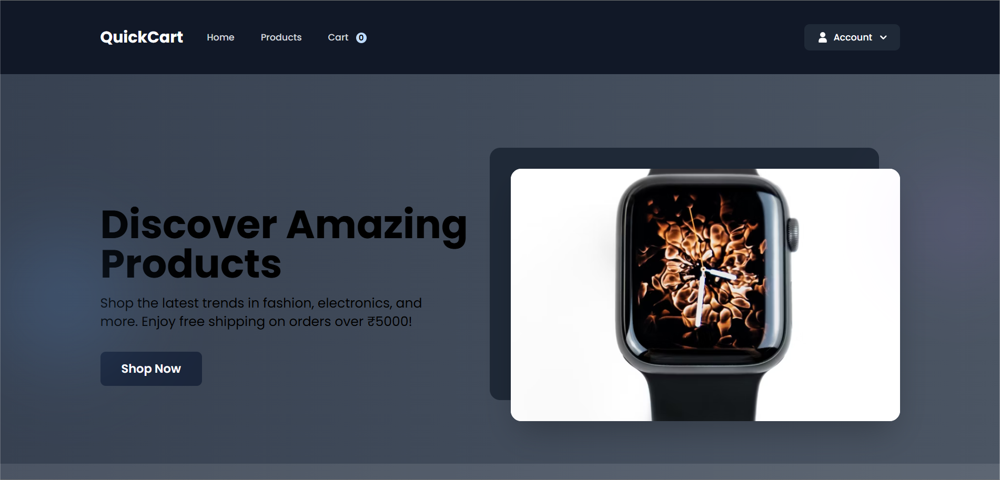
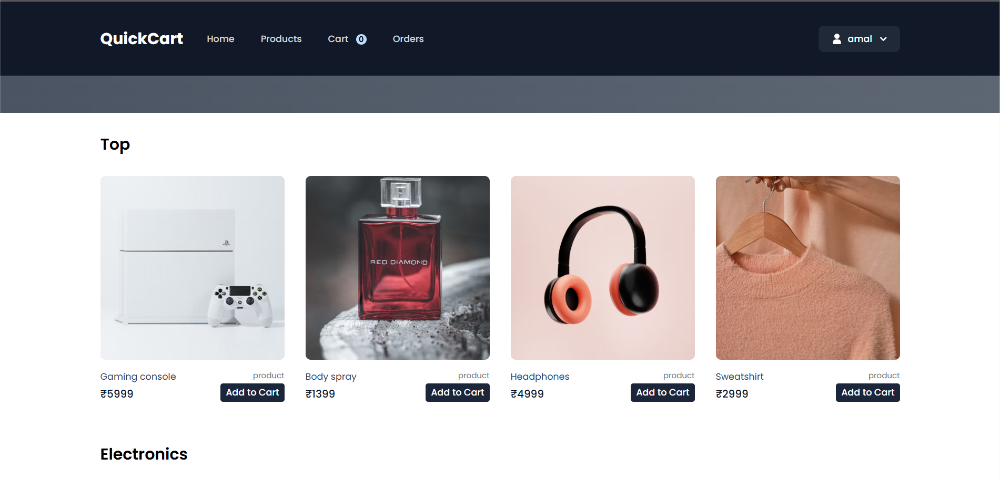

# 🛒 E-Commerce Application

A full-stack e-commerce web application built using Node.js, Express.js, MongoDB, Handlebars (hbs), and Tailwind CSS. This platform allows users to browse products, manage their cart, make payments using Razorpay, and enables admins to manage products and orders through a dedicated dashboard.

---

## 📸 Screenshots

| Home Page | Product Page |
|-----------|--------------|
|  |  |

---

## 🚀 Features

- 🧾 Product listing by categories
- 🔐 User authentication & authorization
- 🛒 Add to cart & manage cart items
- 💳 Razorpay payment gateway (Online and COD)
- 👨‍💻 Admin dashboard for managing products & orders
- 📱 Responsive design with Tailwind CSS
- 🌐 Clean and SEO-friendly routing using Handlebars

---

## 🛠️ Technologies Used

### Frontend
- HTML
- CSS
- JavaScript
- Tailwind CSS
- Handlebars (hbs)

### Backend
- Node.js
- Express.js

### Database
- MongoDB
- Mongoose

### Payment Integration
- Razorpay

---

## 📦 Installation & Setup

> Make sure you have Node.js and MongoDB installed locally.

### 1. Clone the repository

```bash
git clone https://github.com/yourusername/e-commerce-app.git
cd e-commerce application
```

### 2. Install dependencies
```bash
npm install
```

### 3. Create a .env file
```bash
PORT=3000
MONGODB_URI=mongodb://localhost:27017/ecommerce
RAZORPAY_KEY_ID=your_key_id
RAZORPAY_KEY_SECRET=your_key_secret
SESSION_SECRET=your_session_secret
```

### 4. Start the server
```bash
npm run start
```

### 🔗 Live Demo
https://e-commerce-application-backend-a074.onrender.com 

### 📄 License
This project is licensed under the MIT License.